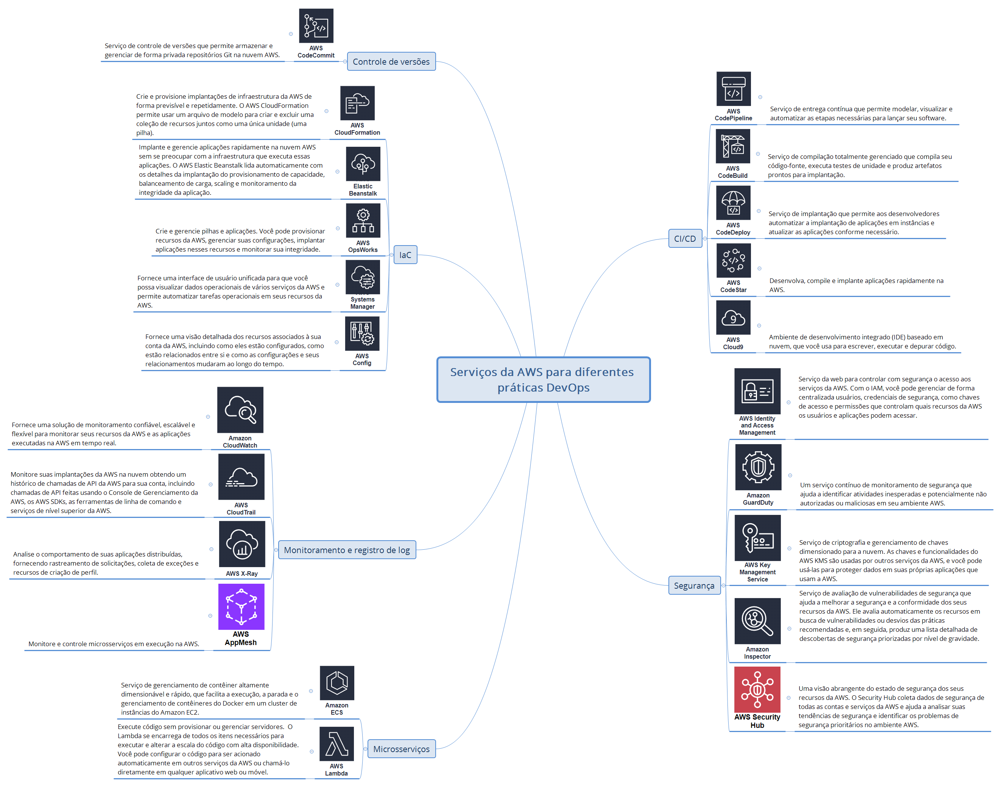

# Módulo 1: Introdução ao DevOps

## 1.1 O que é DevOps?

DevOps é uma combinação de filosofias culturais, práticas e ferramentas que combinam desenvolvimento de software com operações e tecnologia da informação. Essas práticas permitem que as empresas forneçam novos recursos de aplicações e serviços aprimorados aos clientes em uma **velocidade maior**.


## 1.2 Topologias do DevOps

Na figura abaixo veja alguns exemplos de topologias e antitipos (antipadrões) de DevOps:


- `1` - Silos de desenvolvedor e de operações: essa é uma topologia mais comum do que a maioria das pessoas acha. O desenvolvimento e as operações são entidades separadas que passam o produto entre as equipes.
- `2` - Colaboração entre desenvolvedor e operação: essa topologia é um equilíbrio colaborativo entre o desenvolvimento e as operações. Há espaço suficiente para permitir que o desenvolvimento e as operações se especializem na própria área, mas se unam e colaborem para obter eficiência e um melhor produto final.
- `3` - Silo da equipe DevOps: outro antitipo é quando há uma equipe específica de DevOps (atuando em separado como uma entidade própria) que opera entre a equipe de desenvolvimento e operações. Mais uma vez, as equipes estão isoladas, o que aumenta a distância entre a equipe de operações e desenvolvimento original.
- `4` - Responsabilidades de operações totalmente compartilhadas e integradas: essa topologia mostra muito pouca ou nenhuma separação entre as equipes de desenvolvimento e operações. Para que essa topologia seja bem-sucedida, todos os membros de ambas as equipes estão altamente focados em um propósito comum e estão igualmente envolvidos em todos os processos.

## 1.3 Jornada da Amazon para o DevOps

No início aplicações monolíticas fortemente acopladas e equipes em silos... A tecnologia começou a ser um gargalo no processo de inovação da empresa.

```
A base de código da aplicação é muito extensa para muitas responsabildiades de negócio.
```

Desafios das aplicações monolíticas:
- Plataforma única e grande;
- Ciclos de desenvolvimento demorados;
- Complexidade com scaling e tolerância a falhas;
- As falhas afetam toda a arquitetura (modelo monolítico);
- Refatorar para corrigir falhas ou bugs (ciclo de implantação mais longo).

Conforme os anos passaram a Amazon começou a organizar os times por responsabilidades de negócio e a utilizar microserviços. 

```
Os microserviços são uma abordagem arquitetônica e organizacional composta por pequenos serviços independentes otimizados para DevOps.
```

Propriedades de uma equipe pequena:
- Propriedade total;
- Responsabilidade total:
	- Responsável por um pequeno pedaço do negócio.
- Adesão aos princípios de "DevOps";
- Inovação orientada;

## 1.4 Fatores que impulsionam a transformação do DevOps


Alinhamento da mentalidade organizacional, capacitação de engenharia e capacidação do desenvolvedor.


## 1.5 Práticas de DevOps

```
A transição para o DevOps requer uma mudança de cultura e mentalidade;
```

Cultura DevOps:
- É focado em remover barreiras;
- Trabalhe em conjunto para otimizar a produtividade dos desenvolvedores e a confiabilidade das operações;
- Pessoas acima de processos acima de ferramentas.

Práticas de DevOps:


Etapas do processo de lançamento (pipeline de CI/CD):


Na entrega contínua ainda é necessário um passo manual para implentação.

## 1.6 Padrão arquitetural mais compatível

Pipeline em aplicações monolíticas:

Na aplicação monolítica os desenvolvedores trabalham em cima de uma base de código que vai compreender todas as responsabilidades de negócio que eu tenho. Além disso, eu tenho um único pipeline de entrega de software para a base de código.


Com microserviços eu do a possibilidade das minhas equipes de desenvolvimento de trabalharem de maneira independente, sendo donas de uma parte da aplicação (de uma responsabilidade de negócio). Desse modo, tem-se várias equipes de desenvolvedores trabalhando em um serviço particular, possibilitando ter uma esteira ou pipeline de entrega para cada serviço.


Desse modo, temos equipes em volta de responsabilidades de negócio e não em camadas tecnológicas.

## 1.7 Infraestrutura como código

## 1.8 Monitoramento e registros
- Observe e rastreie grandes conjuntos de dados de aplicativos e infraestrutura;
- Informações e visibilidade operacional;
- Colete as métricas;
- Melhore o desempenho.
## 1.9 Serviços da AWS para práticas DevOps


